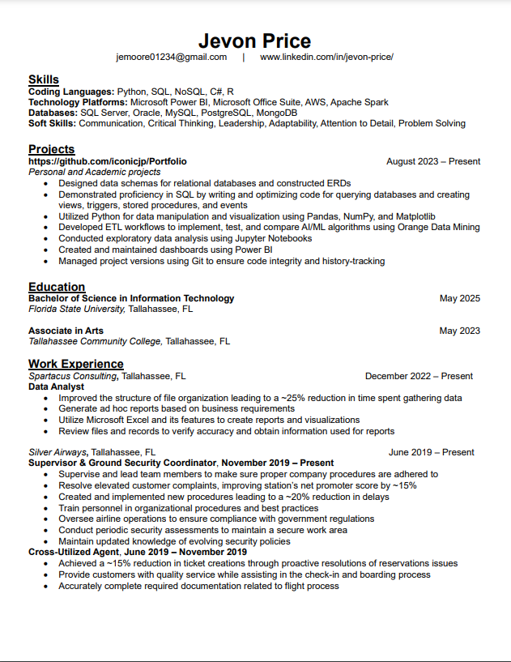

> **NOTE:** This README.md file should be placed at the **root of each of your main directory.**

# Jevon Price
* Here is my [LinkedIn: https://www.linkedin.com/in/jevon-price/](https://www.linkedin.com/in/jevon-price/)

## This is a Repo demonstrating some of the projects I have completed in college.

**Course Work Links:**

1. My Resume is at the bottom. Click [here](Resume/resume.pdf "My Resume") to download the PDF version

2. [LIS4369: Extensible Enterprise Solutions](extensible_enterprise_solutions/README.md)
    - This is a class focused on Python and R. Most of the work centered around learning these languages and using them to analyze data (Notably Jupyter Notebook and Pandas). I also learned Git and some Linux in this class.

3. [LIS3784: Intermediate Database Management](intermediate_database_management/README.md)
    - This class is focused on learning SQL and relational database design. It teaches good database design, implementation, and management concepts and techniques. Half of this class was completed in MySQL and the other half in MS SQL Server.

4. [LIS3781: Advanced Database Management](advanced_database_management/README.md)
    - This class is focused on DMBS managment and Advanced SQL techniques. The class goes over MySQL, MS SQL Server, Oracle and MongoDB(NoSQL). (This class is currenty in progress)

 
 

