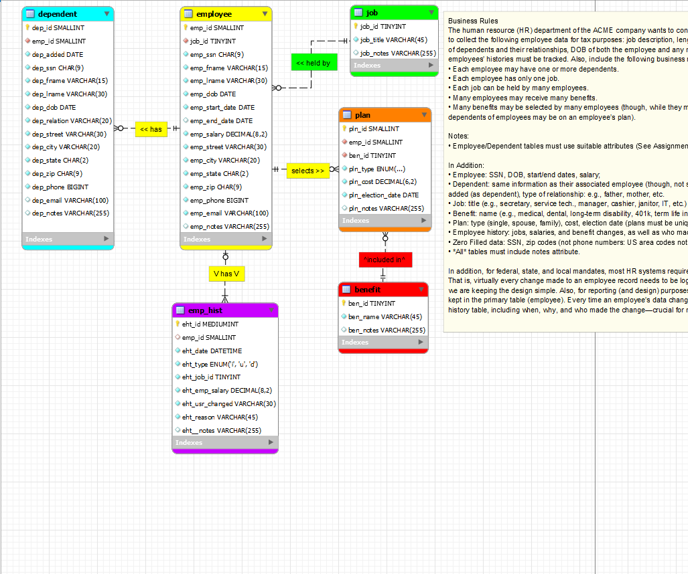
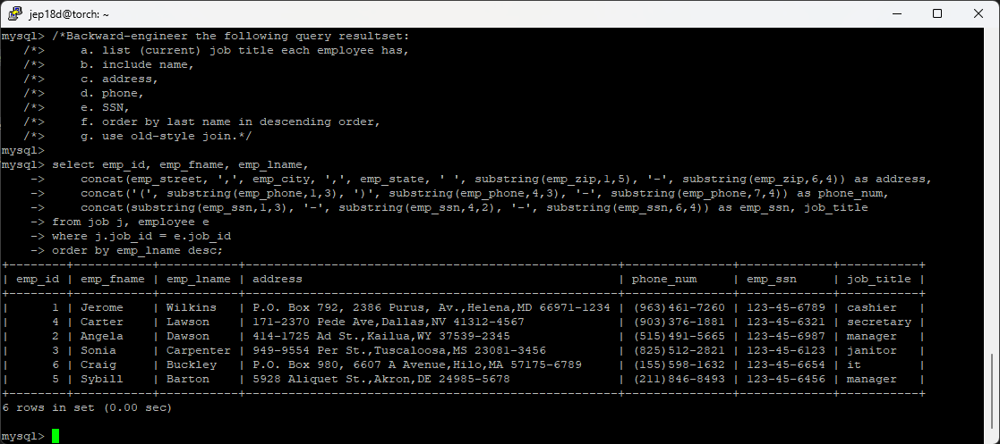
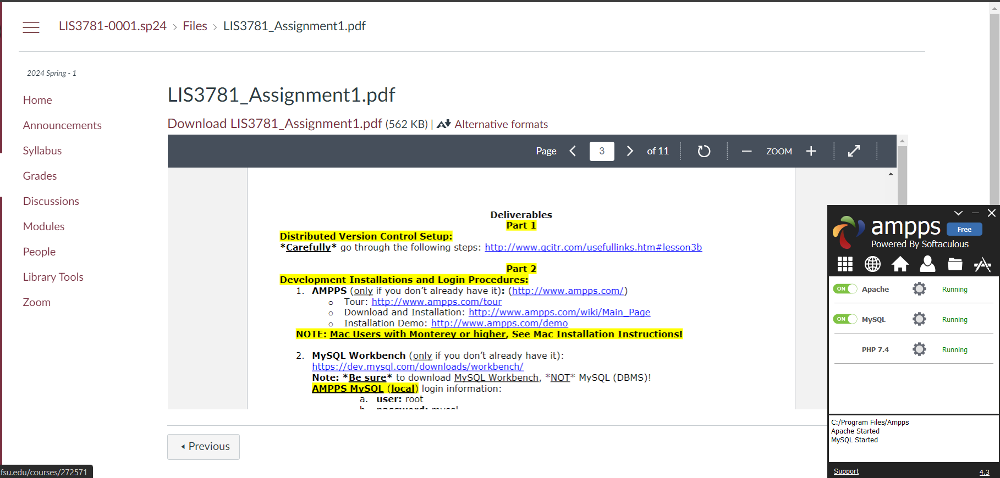

> **NOTE:** This README.md file should be placed at the **root of each of your repos directories.**
>
>Also, this file **must** use Markdown syntax, and provide project documentation as per below--otherwise, points **will** be deducted.
>

# LIS3781 - Advanced Database Management

## Jevon Price

### Assignment 1 Requirements:

***Parts:***

1. Distributed version control with Git and Bitbucket
2. AMPPS installation
3. Entity Relationship diagram and SQL code [lis3781_a1_solutions.sql](a1/lis3781_a1_solutions.sql)
4. Bitbucket repo links
    * This assignment
    * Completed Bitbucket tutorial(bitbucketstationlocations)
5. Questions

#### README.md file should include the following items:

* Screenshot of A1 ERD
* At least 1 SQL Solution (eg. Ex1)
* Forward-engineered .sql file [lis3781_a1_solutions.sql](a1/lis3781_a1_solutions.sql)
* Git commands with short descriptions

#### Git commands w/short descriptions:

1. git init - Create an empty Git repository or reinitialize an existing one
2. git status - Show the working tree status
3. git add - Add file contents to the index
4. git commit - Record changes to the repository
5. git push - Update remote refs along with associated objects
6. git pull - Fetch from and integrate with another repository or a local branch
7. git clean - Remove untracked files from the working tree

#### **A1 Business Rules**
The human resource (HR) department of the ACME company wants to contract a database modeler/designer to collect the following employee data for tax purposes: job description, length of employment, benefits, number of dependents and their relationships, DOB of both the employee and any respective dependents. In addition, employees’ histories must be tracked. Also, include the following business rules:

* Each employee may have one or more dependents.

* Each employee has only one job.

* Each job can be held by many employees.

* Many employees may receive many benefits.

* Many benefits may be selected by many employees (though, while they may not select any benefits— any dependents of employees may be on an employee’s plan).

* Employee/Dependent tables must use suitable attributes (See Assignment Guidelines);

In Addition:

* Employee: SSN, DOB, start/end dates, salary;

* Dependent: same information as their associated employee (though, not start/end dates), date  added (as dependent), type of relationship: e.g., father, mother, etc.

* Job: title (e.g., secretary, service tech., manager, cashier, janitor, IT, etc.)

* Benefit: name (e.g., medical, dental, long-term disability, 401k, term life insurance, etc.)

* Plan: type (single, spouse, family), cost, election date (plans must be unique)

* Employee history: jobs, salaries, and benefit changes, as well as who made the change and why;

* Zero Filled data: SSN, zip codes (not phone numbers: US area codes not below 201, NJ);

* *All* tables must include notes attribute.

In addition, for federal, state, and local mandates, most HR systems require extensive history-keeping. Also, for reporting (and design) purposes, all *current* data should be kept in the primary table (employee). Every time an employee’s data changes, it should be logged in the history table, including when, why, and who made the change—crucial for reporting purposes!

#### Screenshot of A1 ERD

#### Screenshot of A1 Ex1

#### Screenshot of Ampps

#### Tutorial Links:

*Bitbucket Tutorial - Station Locations:* [Bitbucket Station Locations Tutorial Link](https://bitbucket.org/jep18d-ws/bitbucketstationlocations/src/main/ "Bitbucket Station Locations")

