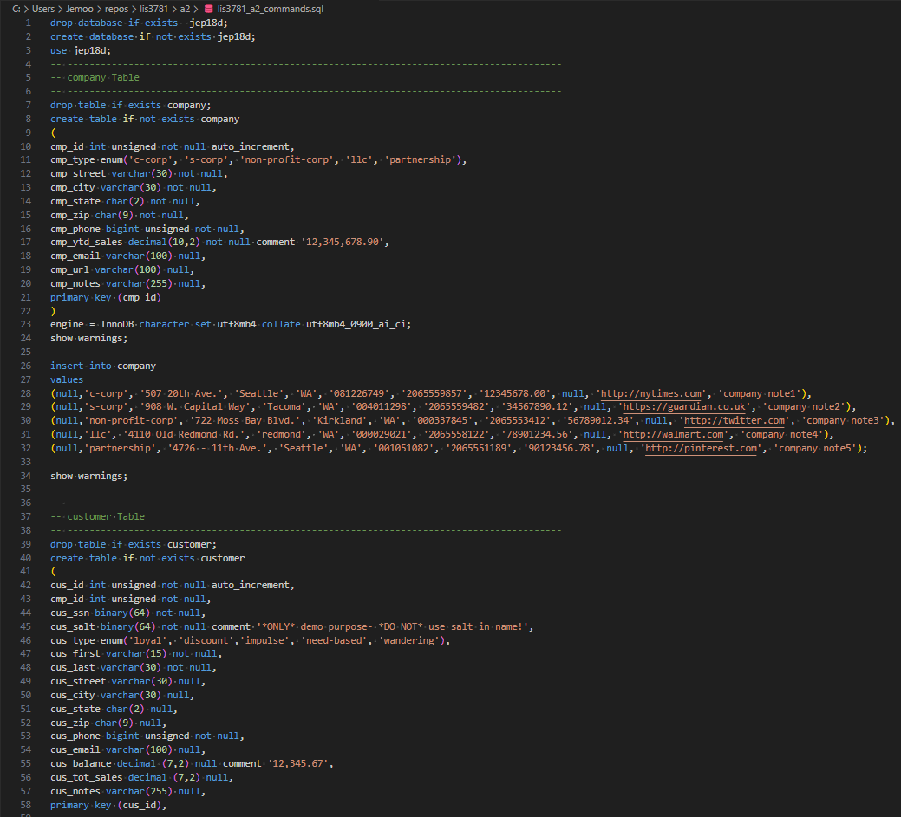
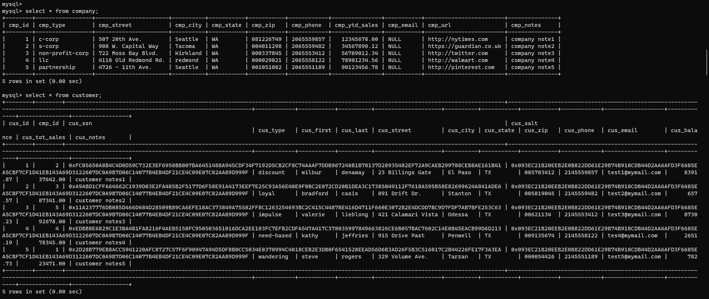

> **NOTE:** This README.md file should be placed at the **root of each of your repos directories.**
>
>Also, this file **must** use Markdown syntax, and provide project documentation as per below--otherwise, points **will** be deducted.
>

# LIS3781 - Advanced Database Management

## Jevon Price

### Assignment 2 Requirements:

***Parts:***

1. Create Company and Customer tables with apropriate indexes and constraints
2. Create Users and grant them provided permissions
3. Demo user privileges
5. Include queries in [lis3781_a2_solutions.sql](lis3781_a2_solutions.sql)
6. Questions

#### README.md file should include the following items:

1. Screenshot SQL code
2. Screenshot populated tables
3. Link to [lis3781_a2_solutions.sql](lis3781_a2_solutions.sql)

")

")

