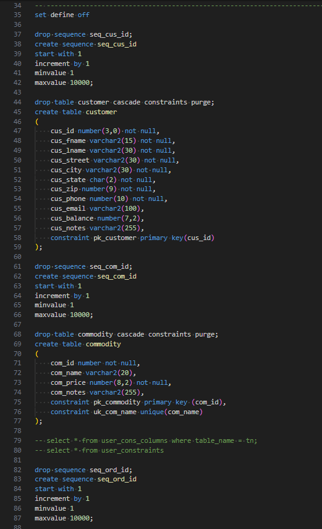
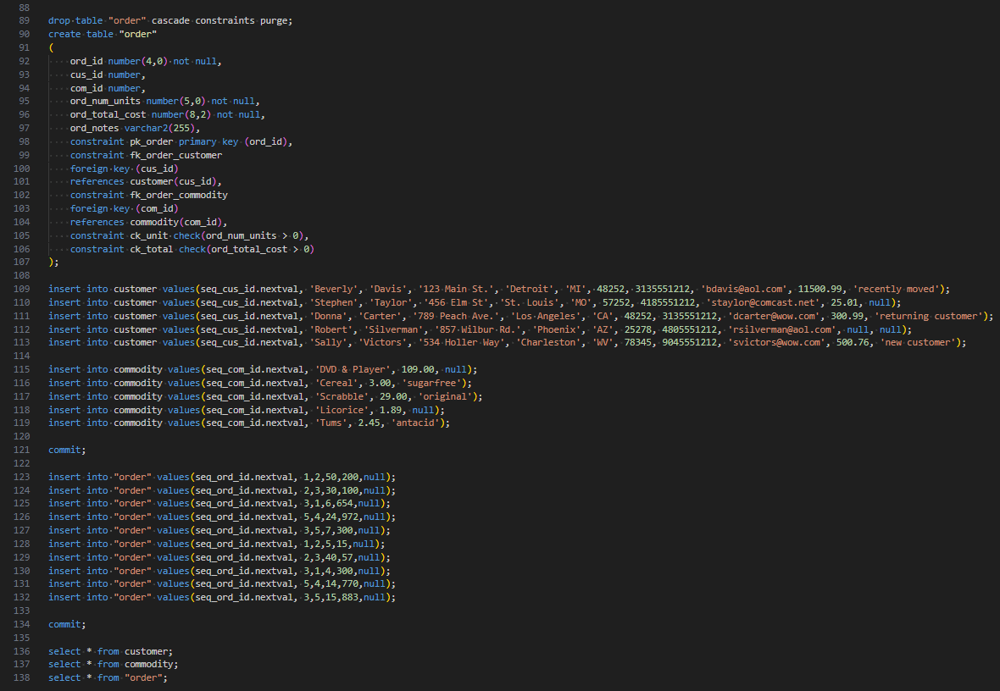
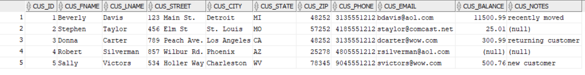
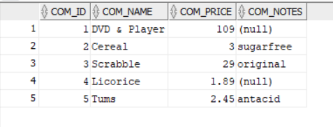
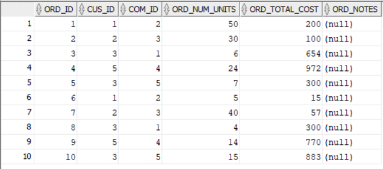
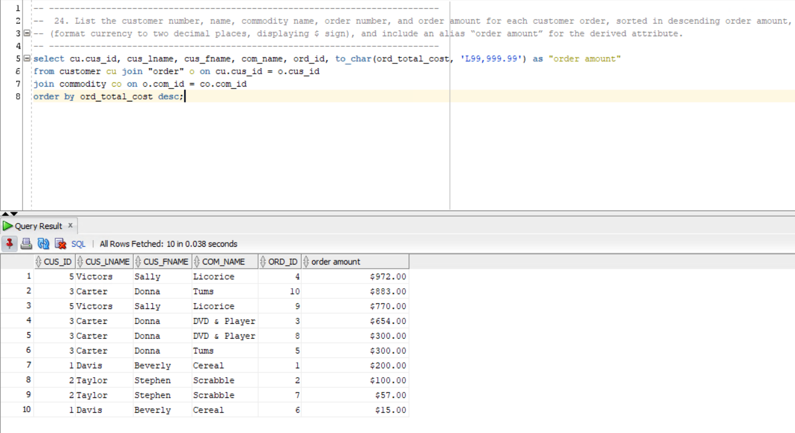

> **NOTE:** This README.md file should be placed at the **root of each of your repos directories.**
>
>Also, this file **must** use Markdown syntax, and provide project documentation as per below--otherwise, points **will** be deducted.
>

# LIS3781 - Advanced Database Management

## Jevon Price

### Assignment 3 Requirements:

***Parts:***
1. Log into Oracle
2. Create and populate tables
3. Complete reports
4. Include all sql code in [lis3781_a3_solutions.sql](lis3781_a3_solutions.sql)
5. Questions

#### README.md file should include the following items:

1. Screenshot of SQL code
2. Screenshot of populated tables
3. Screenshot of at least 1 report
4. Link to [lis3781_a3_solutions.sql](lis3781_a3_solutions.sql)

