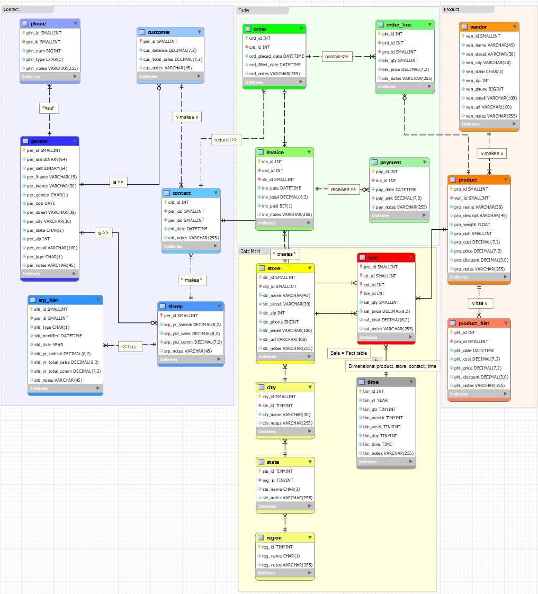
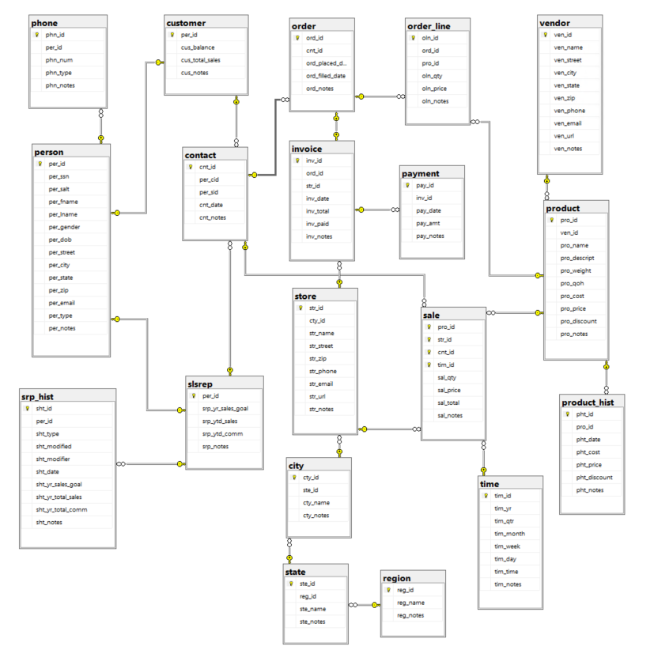
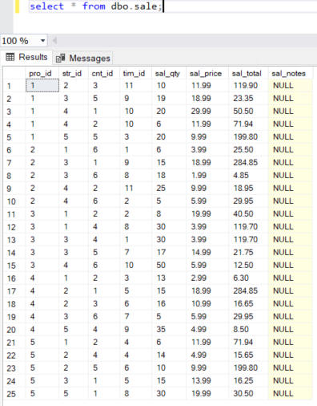
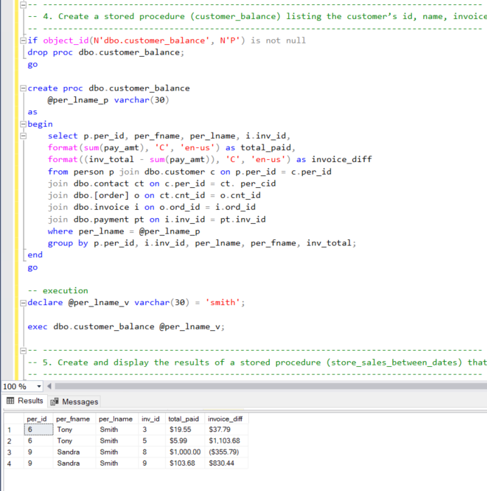
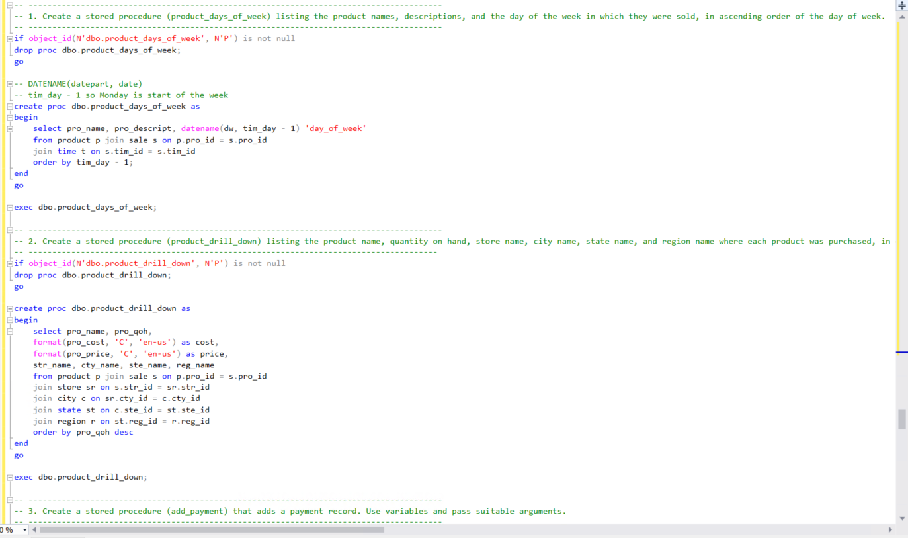

> **NOTE:** This README.md file should be placed at the **root of each of your repos directories.**
>
>Also, this file **must** use Markdown syntax, and provide project documentation as per below--otherwise, points **will** be deducted.
>

# LIS3781 - Advanced Database Management

## Jevon Price

### Assignment 5 Requirements:

***Parts:***

1. Log into MS SQL Server
2. Design Data Mart
3. Create and Populuate Tables
4. Complete reports
5. Questions

#### README.md file should include the following items:

1. Screenshot of ERD
2. Screenshot of at least 1 report and SQL solution
4. Link to [SQL Code](lis3781_a5_solutions.sql)

**Business Rules**

Expanding upon the high-volume home office supply company’s data tracking requirements, the CFO requests your services again to extend the data model’s functionality. The CFO has read about the capabilities of data warehousing analytics and business intelligence (BI), and is looking to develop a smaller data mart as a test platform. He is under pressure from the members of the company’s board of directors who want to review more detailed sales reports based upon the following measurements:

1. Product
2. Customer
3. Sales representative
4. Time (year, quarter, month, week, day, time)
5. Location

Furthermore, the board members want location to be expanded to include the following characteristics of location:

1. Region
2. State
3. City
4. Store

**A5 ERD (in MySQL and SQL Server)**

**Populated Sale Table**

**Solution 4**

**Portion of the SQL Code**

