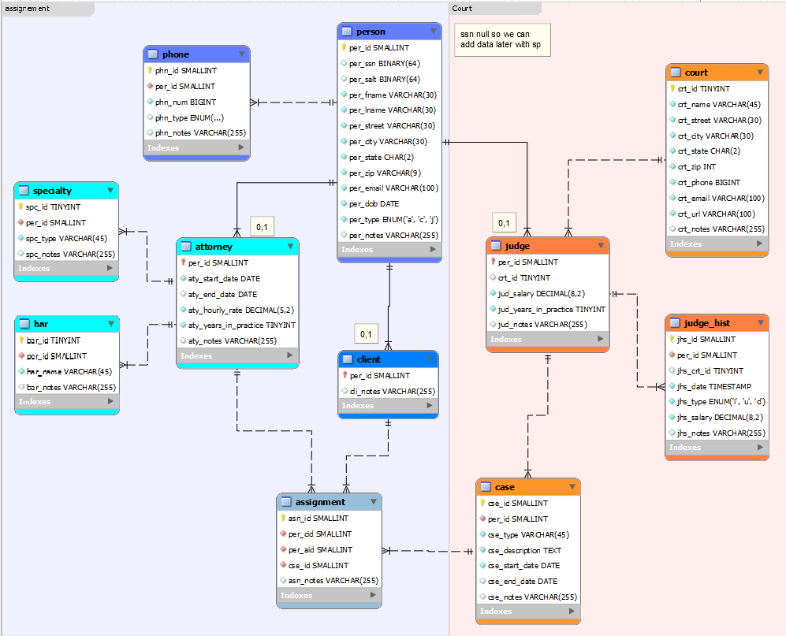
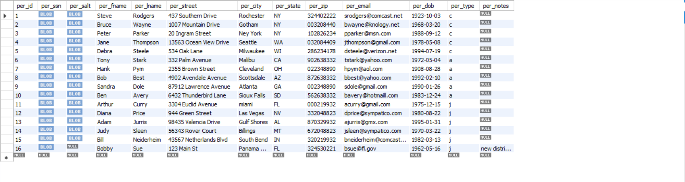
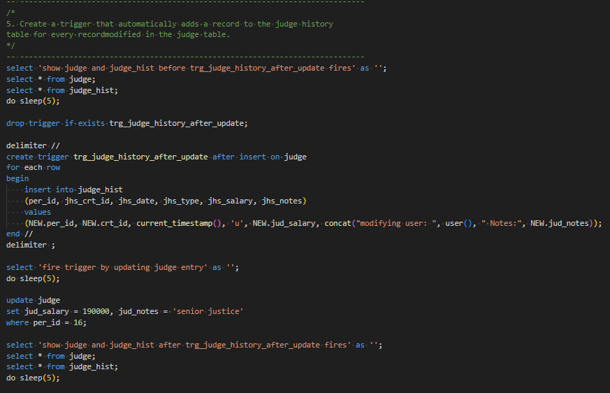

> **NOTE:** This README.md file should be placed at the **root of each of your repos directories.**
>
>Also, this file **must** use Markdown syntax, and provide project documentation as per below--otherwise, points **will** be deducted.
>

# LIS3781 - Advanced Database Management

## Jevon Price

### Project 1 Requirements:

***Parts:***

1. Create tables
2. Populate tables
3. Complete reports
4. Include all sql code in [lis3781_p1_solutions.sql](lis3781_p1_solutions.sql)
5. Questions

#### README.md file should include the following items:

1. Screenshot of ERD
2. Screenshot of at least 1 report
3. Link to [lis3781_p1_solutions.sql](lis3781_p1_solutions.sql)

**Business Rules**

As the lead DBA for a local municipality, you are contacted by the city council to design a database in order to track and document the city’s court case data. Some report examples:

* Which attorney is assigned to what case(s)?
* How many unique clients have cases (be sure to add a client to more than one case)?
* How many cases has each attorney been assigned, and names of their clients (return number andnames)?
* How many cases does each client have with the firm (return a name and number value)?
* Which types of cases does/did each client have/had and their start and end dates?
* Which attorney is associated to which client(s), and to which case(s)?
* Names of three judges with the most number of years in practice, include number of years.

Also, include the following business rules:

* An attorney is retained by (or assigned to) one or more clients, for each case.
* A client has (or is assigned to) one or more attorneys for each case.
* An attorney has one or more cases.
* A client has one or more cases.
* Each court has one or more judges adjudicating.
* Each judge adjudicates upon exactly one court.
* Each judge may preside over more than one case.
* Each case that goes to court is presided over by exactly one judge.
* A person can have more than one phone number.

Notes:

* Attorney data must include social security number, name, address, office phone, home phone, e-mail,start/end dates, dob, hourly rate, years in practice, bar (may be more than one - multivalued), specialty(may be more than one - multivalued).
* Client data must include social security number, name, address, phone, e-mail, dob.
* Case data must include type, description, start/end dates.
* Court data must include name, address, phone, e-mail, url.
* Judge data must include same information as attorneys (except bar, specialty and hourly rate; instead, use salary).
* Must track judge historical data—tenure at each court (i.e., start/end dates), and salaries.
* Also, history will track which courts judges presided over, if they took a leave of absence, or retired.
* All tables must have notes.

Additional Notes:

* Social security numbers, should be unique, and must use SHA2 hashing with salt.
* Entities must be included in logical layers (colored appropriately).
* ERD MUST include relationships and cardinalities.

