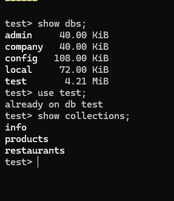
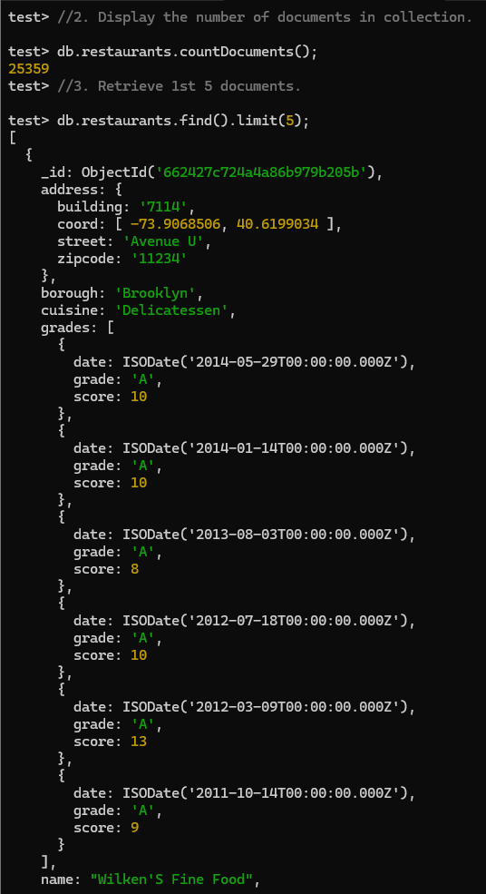
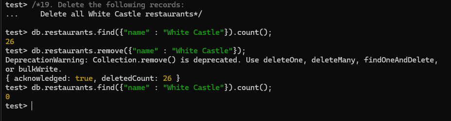

> **NOTE:** This README.md file should be placed at the **root of each of your repos directories.**
>
>Also, this file **must** use Markdown syntax, and provide project documentation as per below--otherwise, points **will** be deducted.
>

# LIS3781 - Advanced Database Management

## Jevon Price

### Project 2 Requirements:

***Parts:***

1. Install MongoDB
2. Complete tutorial
3. Import data
4. Complete reports
5. Questions

#### README.md file should include the following items:

1. Screenshot of at least 1 MongoDB shell command
2. Screenshot of at least 1 report
3. Link to [Report Code](lis3781_p2_solutions.js)

**Shell Commands**

**Reports**

