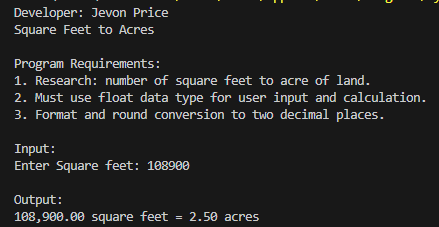
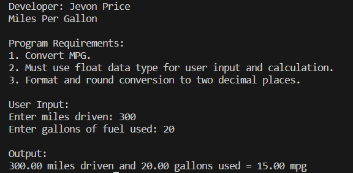
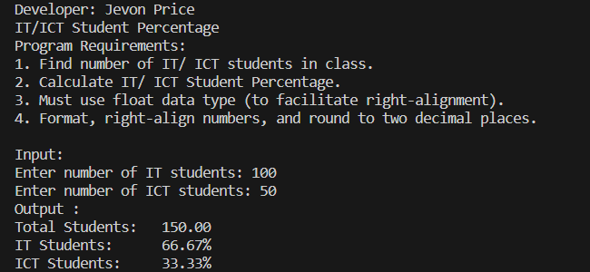
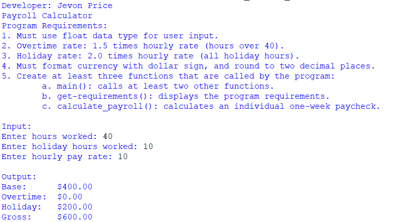
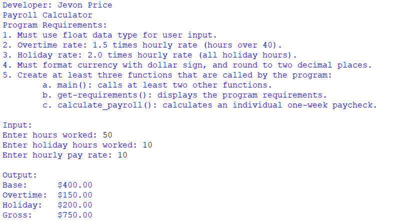
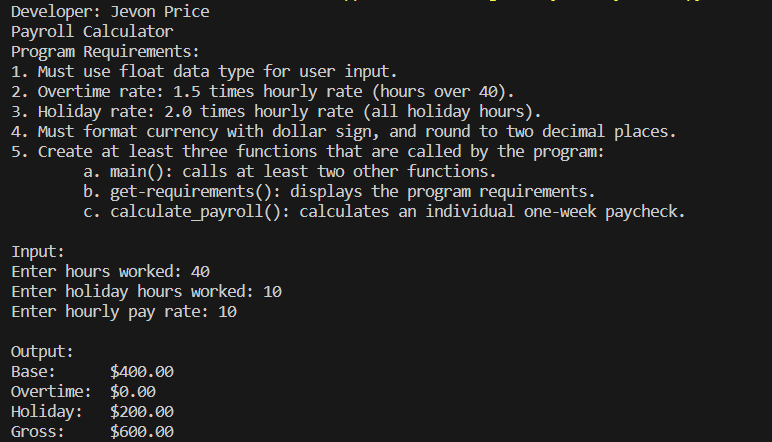
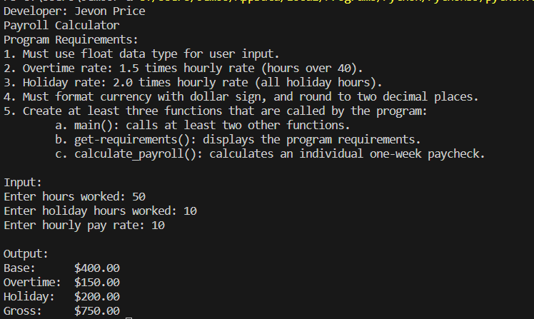
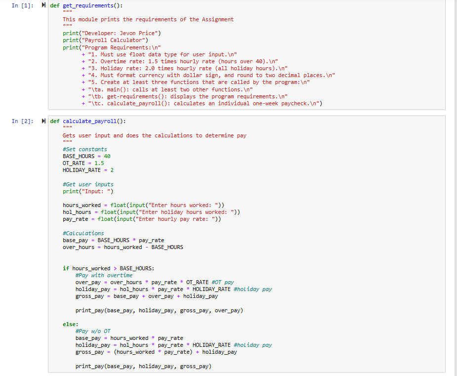
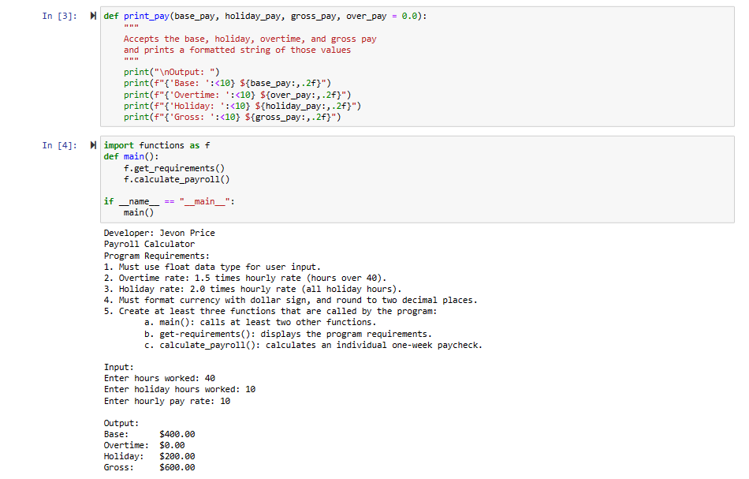
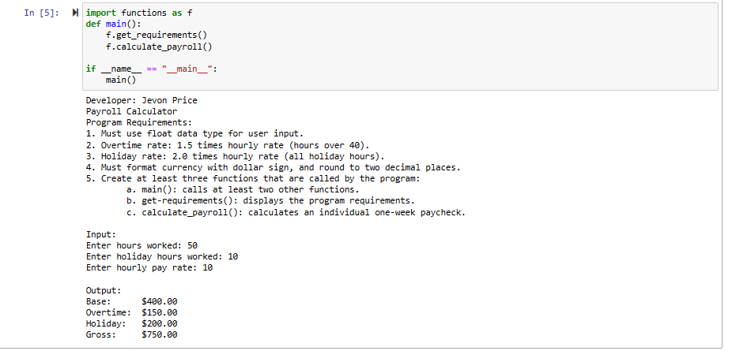

> **NOTE:** This README.md file should be placed at the **root of each of your repos directories.**
>
>Also, this file **must** use Markdown syntax, and provide project documentation as per below--otherwise, points **will** be deducted.
>

# LIS4369 - Extensible Enterprise Solutions

## Jevon Price

### Assignment 2 Requirements:

*Parts:*

1. Development of Payroll Calculator
3. Backward Engineer Skill Sets
2. Questions

#### README.md file should include the following items:

* Screenshot of a2_payroll_calculator application running
* Screenshot of Skill Set applications running
* Link to A2 .ipynb file: [payroll_calculator.ipynb](a2_payroll_calculator/payroll_calculator.ipynb "A2 Jupyter Notebook")

#### Skill set Screenshots:

|Square Foot to Acres | Miles Per Gallon | IT/ICT Student Percentage|
|---------------------|------------------|---------------------------|
||||

#### Screenshot of a2_payroll_calculator application running (IDLE):

|No Overtime|Overtime
|-----------|--------------|
|||

#### Screenshot of a1_payroll_calculator application running (Visual Studio Code):

|No Overtime|Overtime
|-----------|--------------|
|| |

#### A2 Jupyter Notebook:

