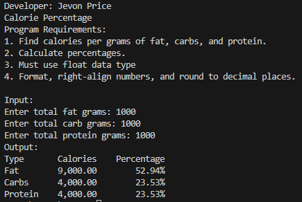
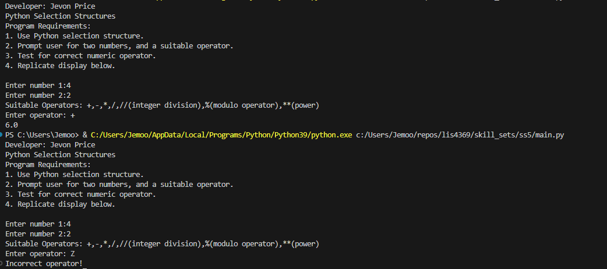
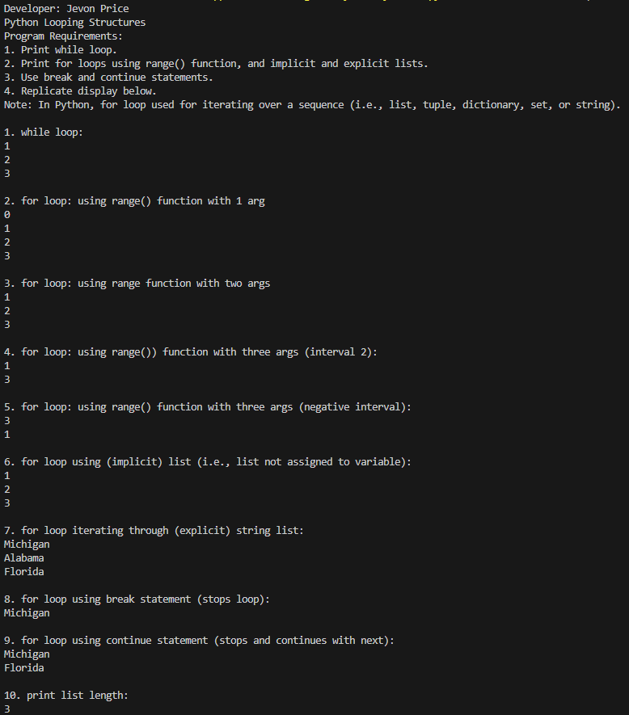
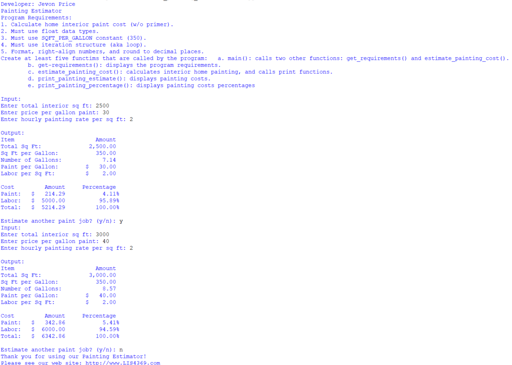
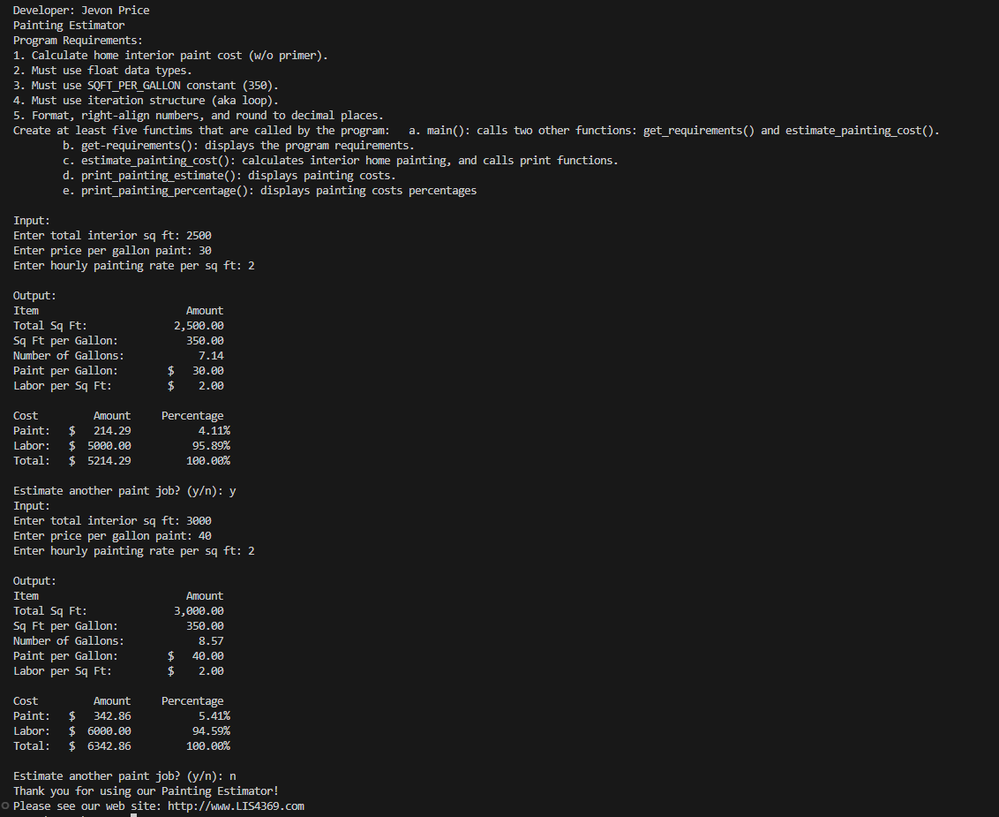
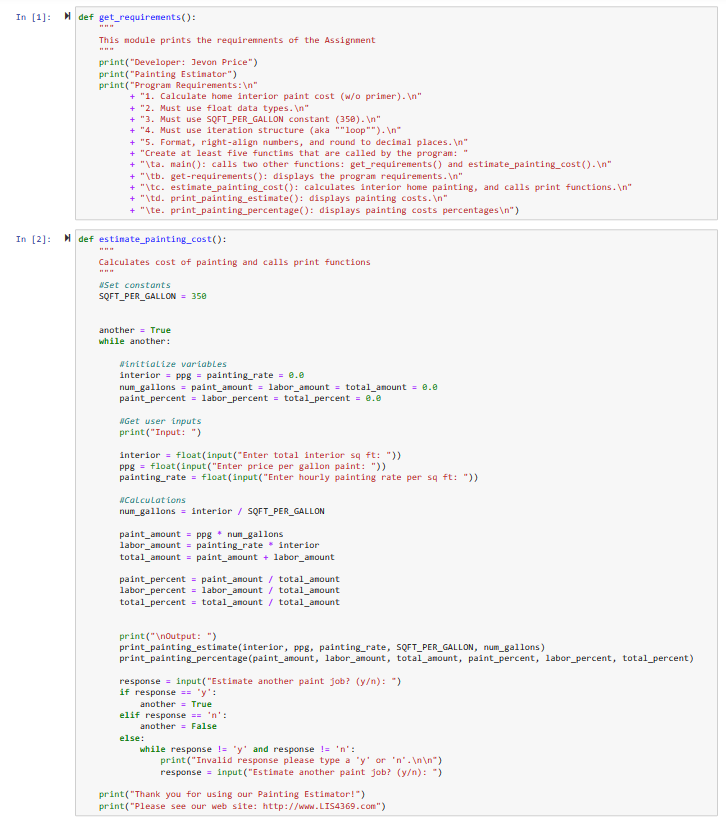
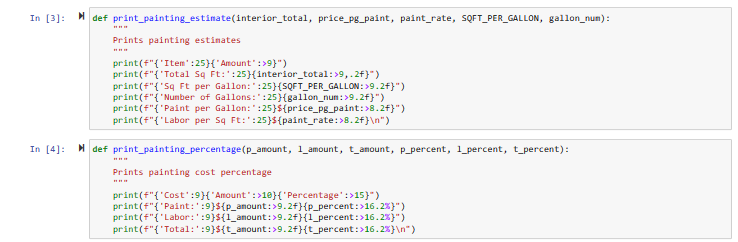
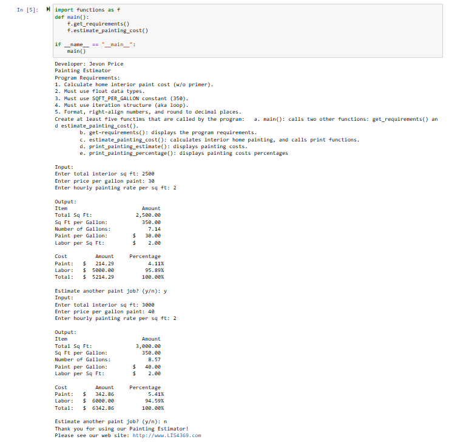

> **NOTE:** This README.md file should be placed at the **root of each of your repos directories.**
>
>Also, this file **must** use Markdown syntax, and provide project documentation as per below--otherwise, points **will** be deducted.
>

# LIS4369 - Extensible Enterprise Solutions

## Jevon Price

### Assignment 3 Requirements:

*Parts:*

1. Development of Painting Estimator
2. Backward Engineer Skill Sets
3. Questions

#### README.md file should include the following items:

* Screenshot of a3_painting_estimator application running in IDLE and VS Code
* Screenshot of Skill Set applications running
* Link to A3 .ipynb file: [painting_estimator.ipynb](a3_painting_estimator/painting_estimator.ipynb "A3 Jupyter Notebook")

#### Skill set Screenshots:

|Calorie Percentage | Selection Structures | Looping Structures|
|---------------------|------------------|---------------------------|
||||

#### Screenshot of a3_painting_estimator application running (IDLE):

|

#### Screenshot of a3_painting_estimator application running (Visual Studio Code):

#### A3 Jupyter Notebook:

