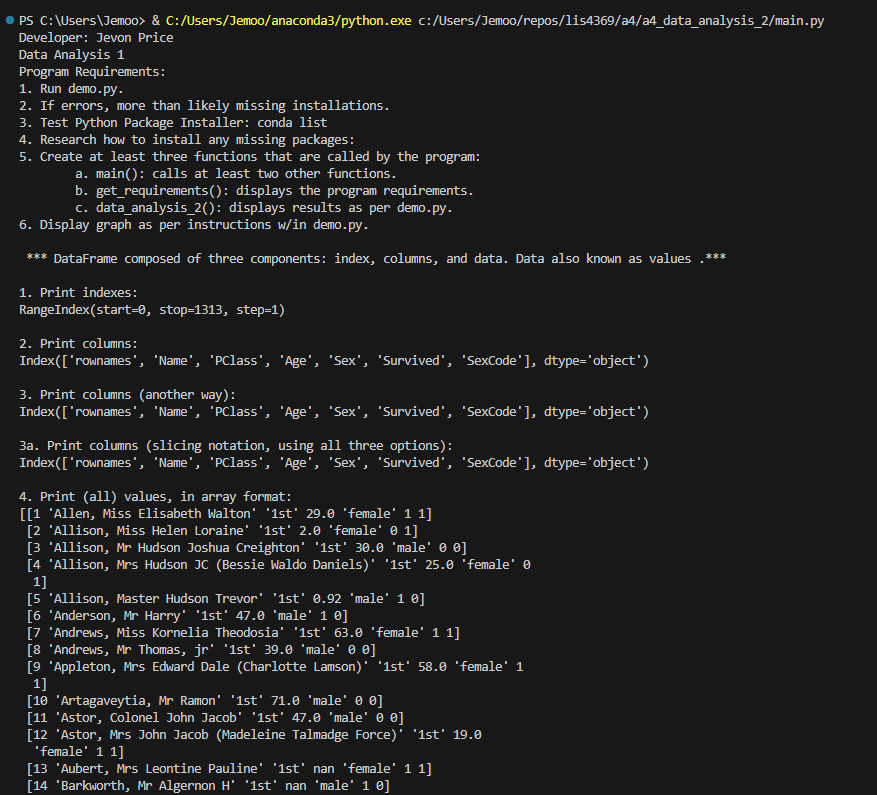

> **NOTE:** This README.md file should be placed at the **root of each of your repos directories.**
>
>Also, this file **must** use Markdown syntax, and provide project documentation as per below--otherwise, points **will** be deducted.
>

# LIS4369 - Extensible Enterprise Solutions

## Jevon Price

### Assignment 4 Requirements:

*Parts:*

1. *Carefully* review the video below.
2. Backward-engineer the screenshot below it.
3. When displaying the required graph (see code in video below), answer the following question:
4. Backward Engineer Skill Sets
5. Questions

#### README.md file should include the following items:

* Assignment requirements, as per A1.
* Screenshots as per examples below, including Jupyter Notebook screenshot, and graph.
    * NOTE: No need to include screenshot of running demo.py
* Upload A4 .ipynb file and create link in README.md;
    * Note: *Before* uploading .ipynb file, *be sure* to do the following actions from Kernal menu:
    * a. Restart & Clear Output
    * b. Restart & Run All
* Screenshot of Skill Set applications running
* Link to A4 .ipynb file: [data_analysis.ipynb](a4_data_analysis_2/a4_data_analysis_2.ipynb "A4 Jupyter Notebook")

#### Skill Set Screenshots:

#### Python Dictionaries:

#### Psuedo-random Number Generator:

#### Temperature Conversion:

#### Screenshot of a4_data_analysis_2 application running (IDLE):

#### Screenshot of a4_data_analysis_2 application running (Visual Studio Code):

#### Screenshot of a4_data_analysis_2 figure:

#### A4 Jupyter Notebook:

