> **NOTE:** This README.md file should be placed at the **root of each of your repos directories.**
>
>Also, this file **must** use Markdown syntax, and provide project documentation as per below--otherwise, points **will** be deducted.
>

# LIS4369 - Extensible Enterprise Solutions

## Jevon Price

### Assignment 5 Requirements:

*Parts*

1. Complete the tutorial: Introduction_to_R_Setup_and_Tutorial; Save as: learn_to_use_r.R
2. Code and run lis4369_a5.R
3. Include at least two 4-panel RStudio screenshots
4. Include at least four plots
5. Backward Engineer Skill Sets
6. Questions

#### README.md file should include the following items:

* Assignment requirements, as per A1.
* Screenshots of output from code *and* tutorial.
* Link to learn_to_use_r.R: [R tutorial](r_tutorial/learn_to_use_r.R)
* Link to A5: [A5 R file](lis4369_a5.R)

#### Skill Set Screenshots:

##### Sphere Volume Calcualator:
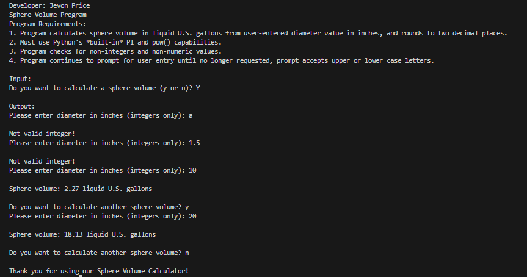

##### Calculator with Error Handling:
|||
| ---- | ---- |
| 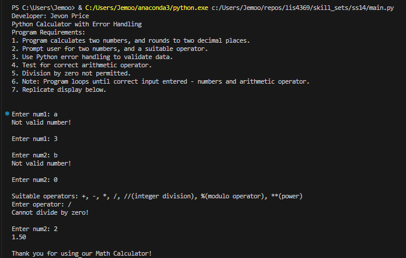 | 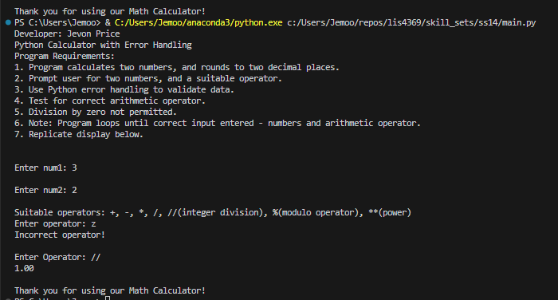|

##### File Read/ Write:
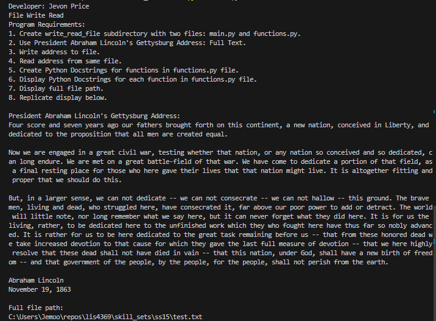

#### Tutorial Screenshots:
|||
|---|---|
|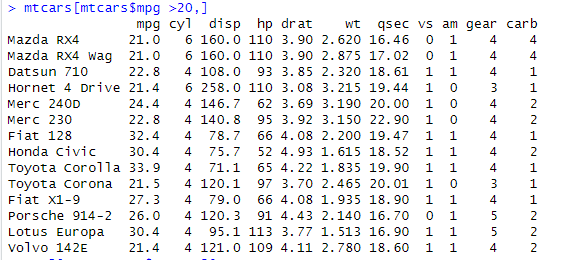|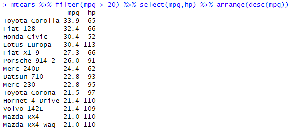|
|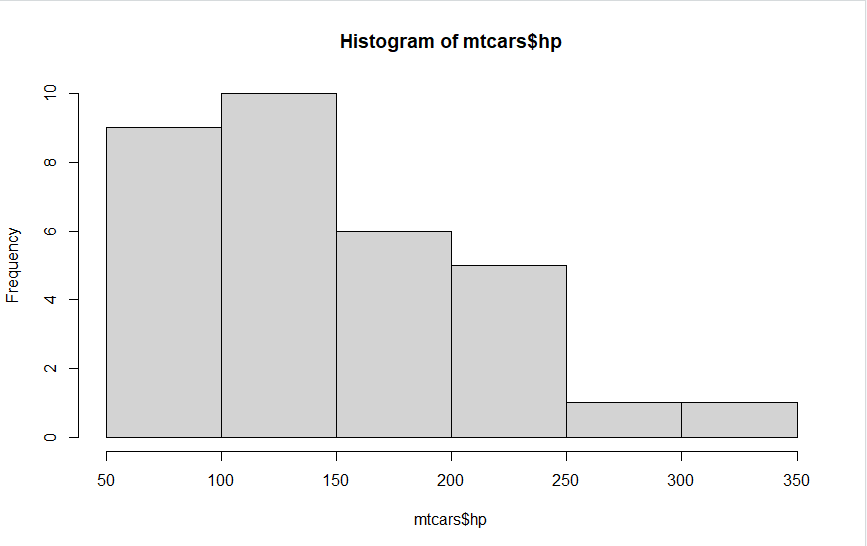|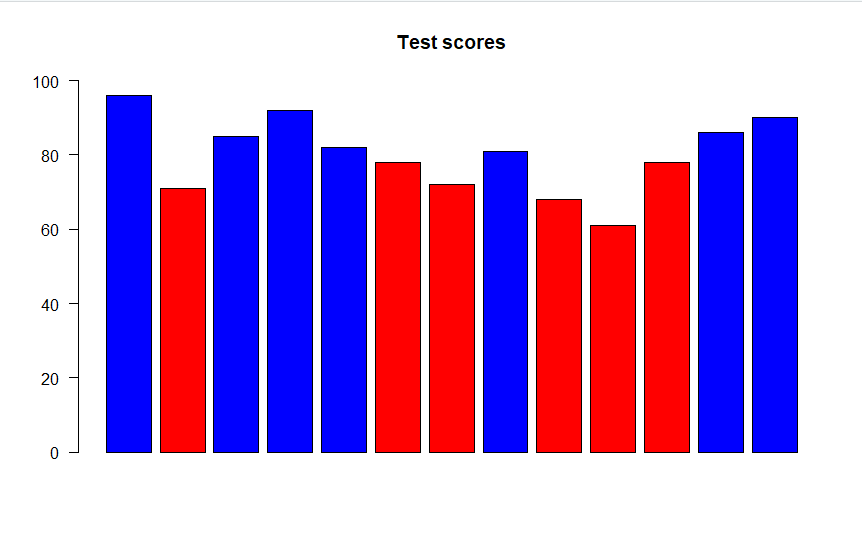|

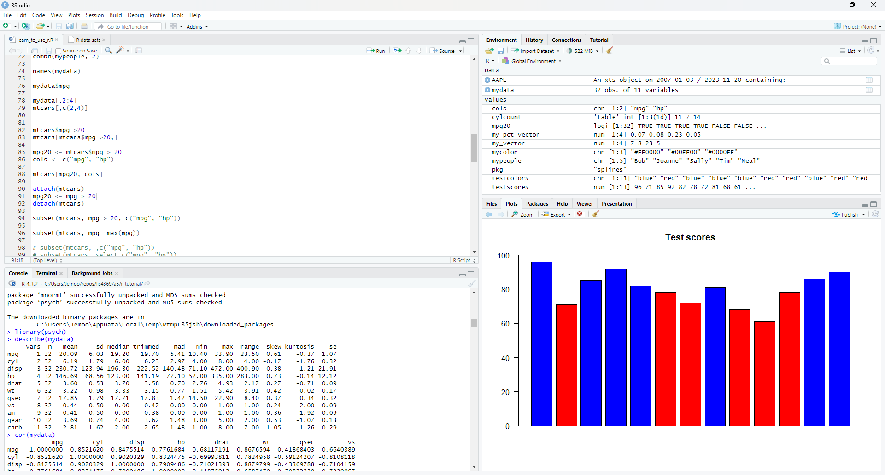

#### A5 Screenshots
|||
|---|---|
||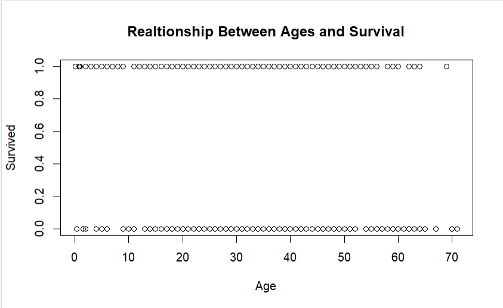|

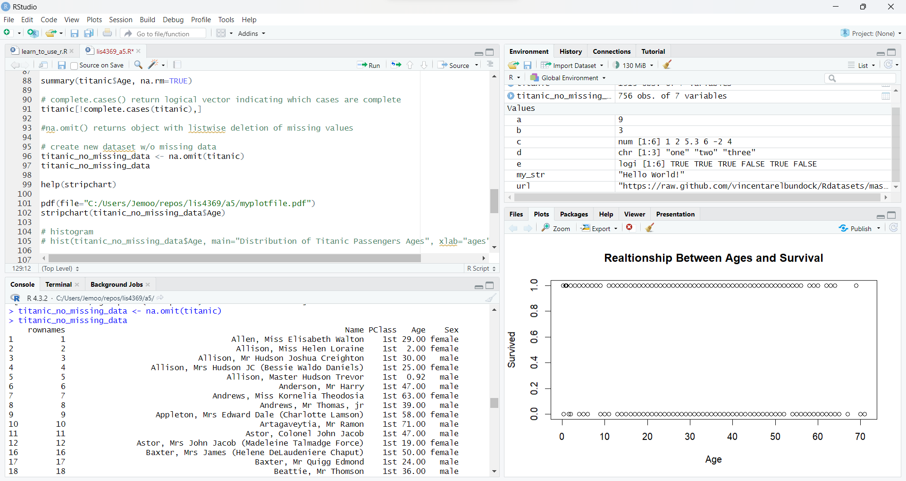