> **NOTE:** This README.md file should be placed at the **root of each of your repos directories.**
>
>Also, this file **must** use Markdown syntax, and provide project documentation as per below--otherwise, points **will** be deducted.
>

# LIS4369 - Extensible Enterprise Solutions

## Jevon Price

### Project 1 Requirements:

*Parts:*

1. Code and run demo.py. (Note: *be sure* necessary packages are installed!)
2. Use it to backward-engineer the screenshots below it
3. Update conda, and install necessary Python packages. Invoke commands below.
4. Backward Engineer Skill Sets
5. Questions

#### README.md file should include the following items:

* Assignment requirements, as per A1.
* Screenshots as per examples below, including Jupyter Notebook screenshot, and graph.
*     NOTE: No need to include screenshot of running demo.py
* Upload P1 .ipynb file and create link in README.md;
*     Note: *Before* uploading .ipynb file, *be sure* to do the following actions from Kernal menu:
*     a. Restart & Clear Output
*     b. Restart & Run All
* Screenshot of Skill Set applications running
* Link to P1 .ipynb file: [data_analysis.ipynb](p1_data_analysis_1/data_analysis.ipynb "P1 Jupyter Notebook")

#### Skill set Screenshots:

|Python Lists | Python Tuples | Python Sets|
|---------------------|------------------|---------------------------|
|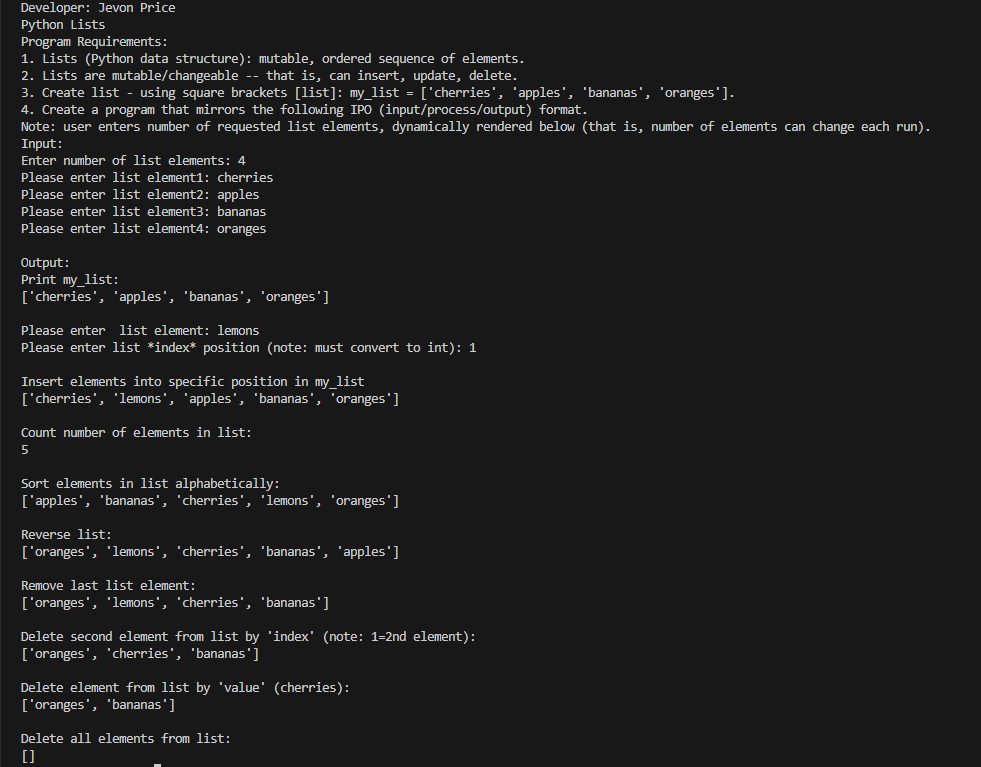|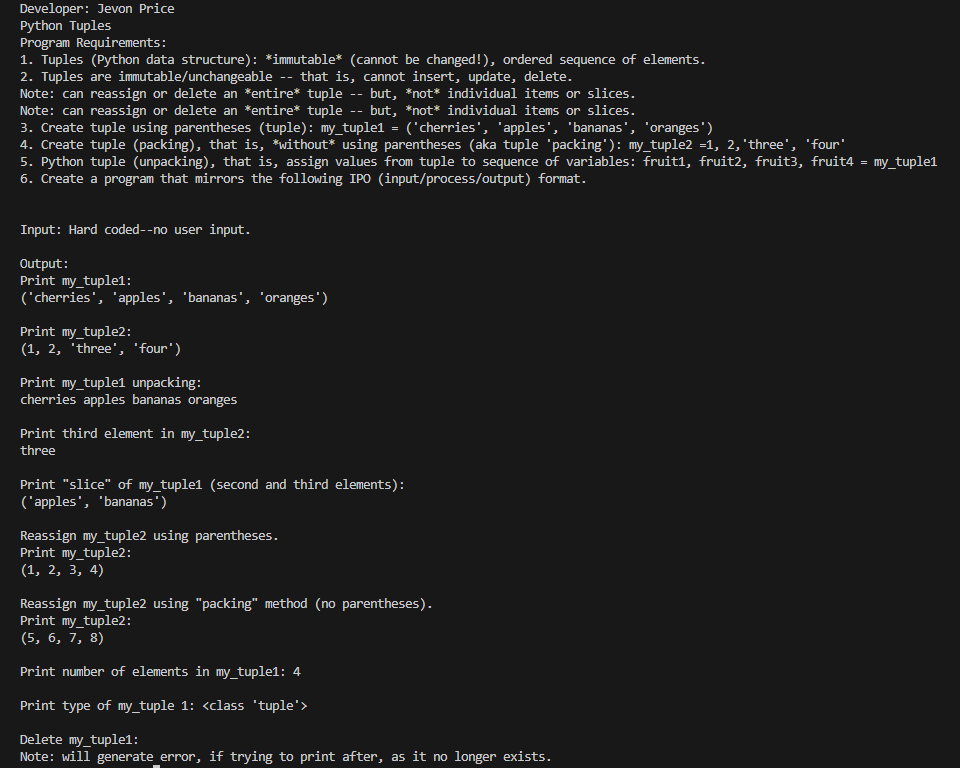|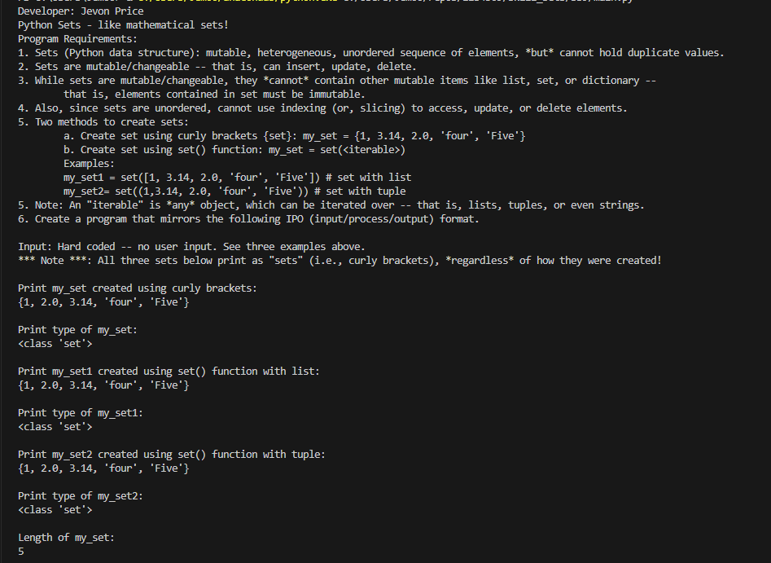|
|-----|-----|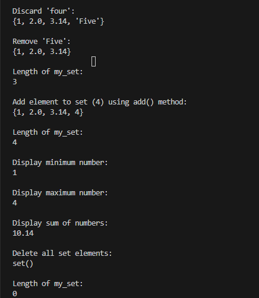|

#### Screenshot of p1_data_analysis_1 application running (IDLE):

|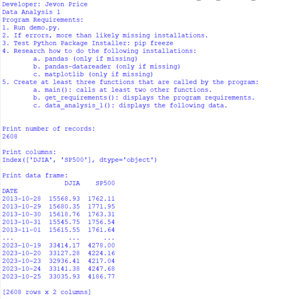|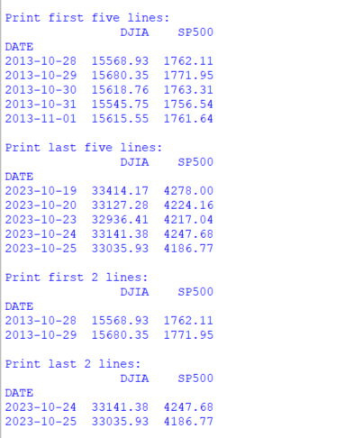|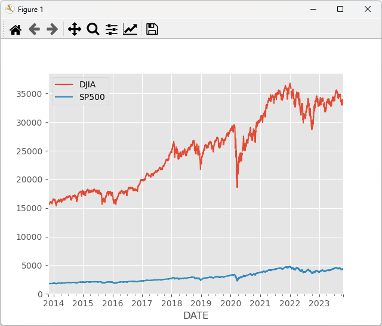|

#### Screenshot of p1_data_analysis_1 application running (Visual Studio Code):

|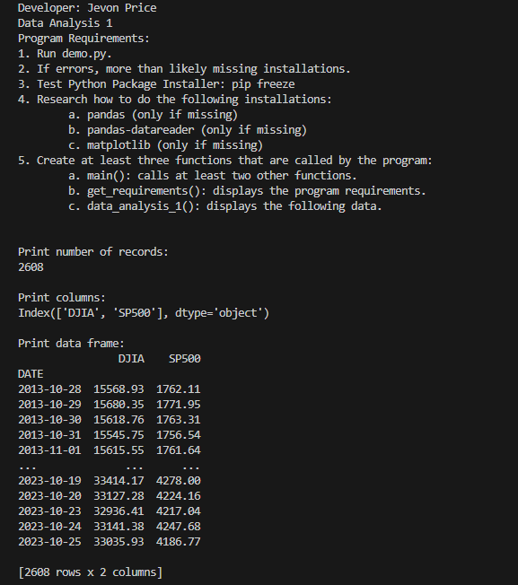|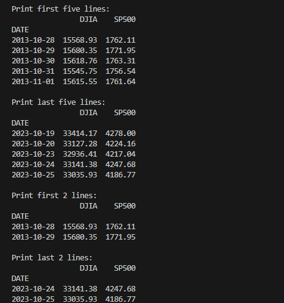|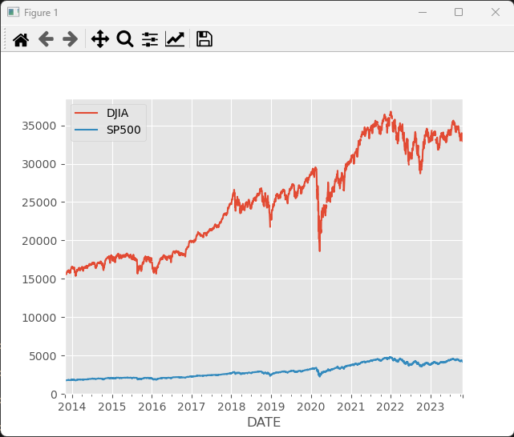|

#### P1 Jupyter Notebook:

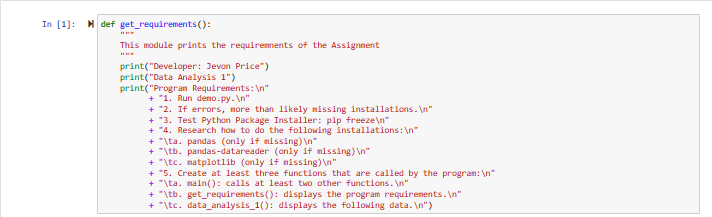
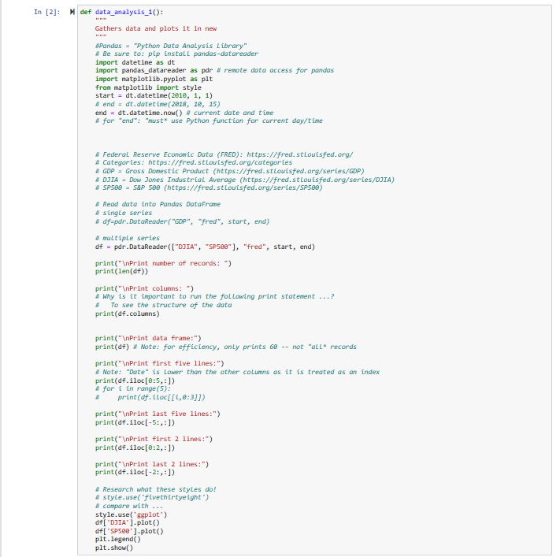
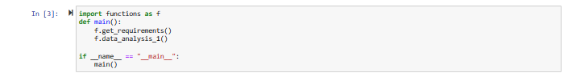
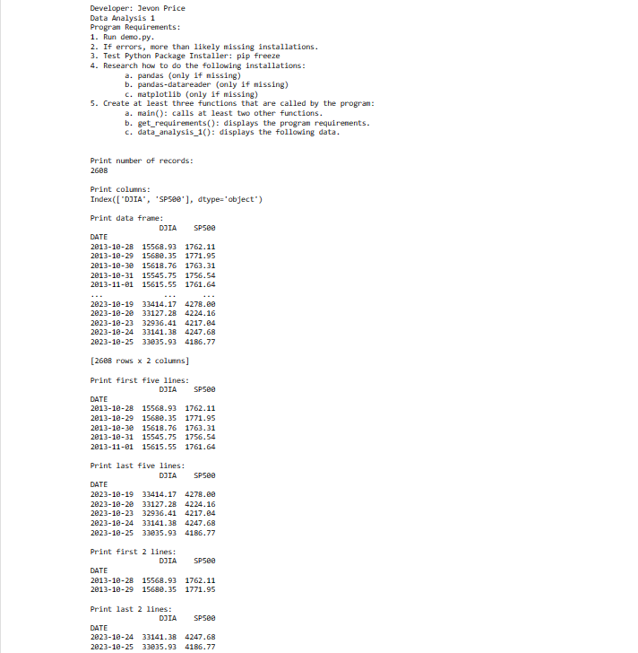
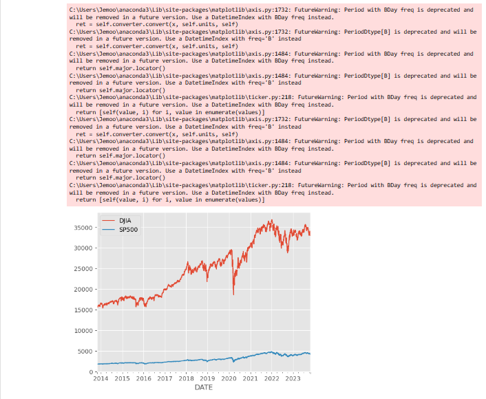
