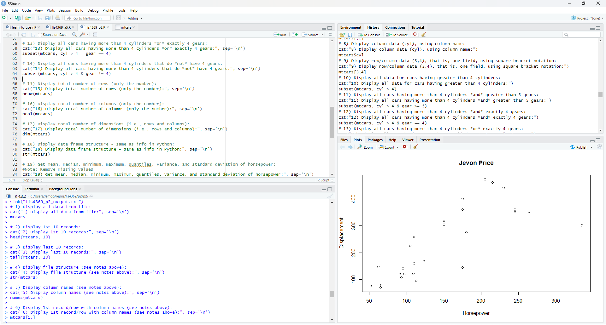

> **NOTE:** This README.md file should be placed at the **root of each of your repos directories.**
>
>Also, this file **must** use Markdown syntax, and provide project documentation as per below--otherwise, points **will** be deducted.
>

# LIS4369 - Extensible Enterprise Solutions

## Jevon Price

### Project 2 Requirements:

*Parts*

1. Code and run lis4369_p2.R
2. Output to .txt file
3. Include 1 4-panel RStudio screenshot
4. Include 2 plot screenshots
5. Questions

#### README.md file should include the following items:

* Assignment requirements, as per A1.
* Screenshots of output
* Link to lis4369_p2.R: [P2 Code](p2/lis4369_p2.R)
* Link to Output .txt: [P2 Output](p2/lis4369_p2_output.txt)

#### P2 Screenshots
|||
|---|---|
|)")|)")|

