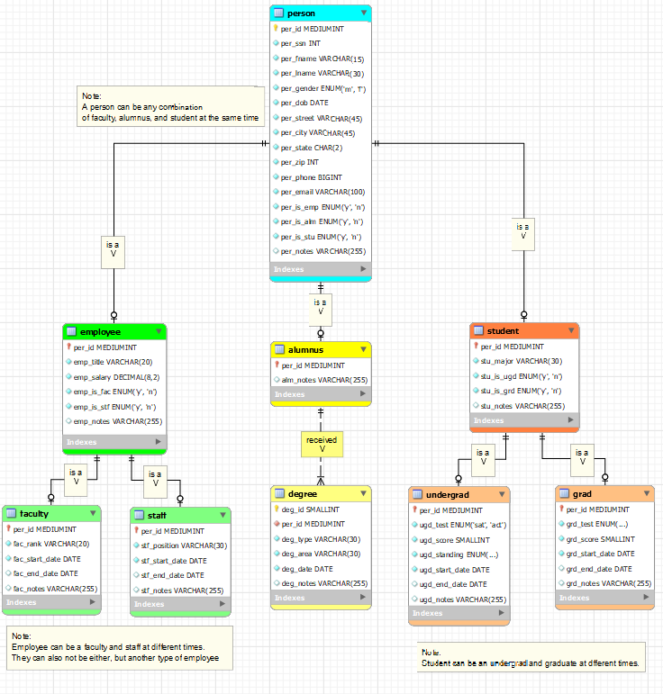

> **NOTE:** This README.md file should be placed at the **root of each of your main directory.**

# LIS3784 - Intermediate Database Management

## Jevon Price

In this unit, we designed and built a database for a university. It tracks students, alumni, and employees.

There is an [Excel file](a2_dd.xlsx) which contains the data dictionary, a [text file](A2_work.txt) to run SQL commands, and the [ERD file](A2model.mwb) along with a picture of the ERD inside this folder

*Here is a picture of the ERD* 