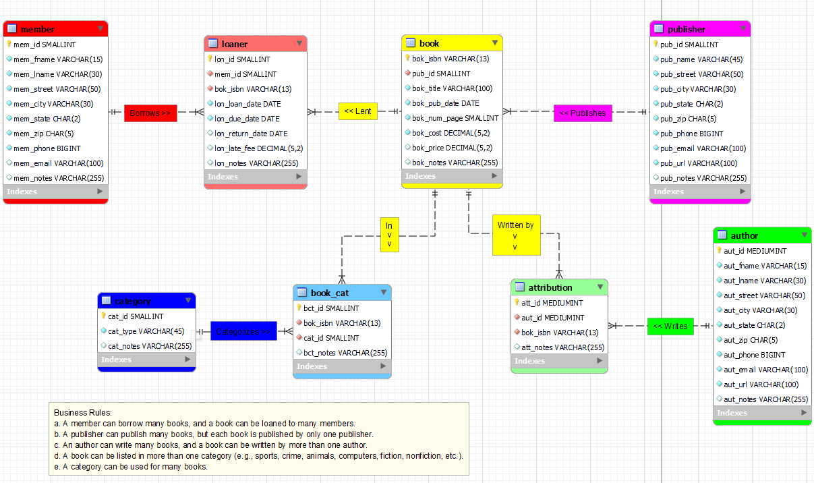

> **NOTE:** This README.md file should be placed at the **root of each of your main directory.**

# LIS3784 - Intermediate Database Management

## Jevon Price

In this unit, we designed and built a database for a library.

**Business Rules:**
* A member can borrow many books, and a book can be loaned to many members.
* A publisher can publish many books, but each book is published by only one publisher.
* An author can write many books, and a book can be written by more than one author.
* A book can be listed in more than one category (e.g., sports, crime, animals, computers, fiction, nonfiction, etc.).
* A category can be used for many books.

There is an [Excel file](A3_dd.xlsx) which contains the data dictionary and the [ERD file](a3model.mwb) along with a picture of the ERD inside this folder.

