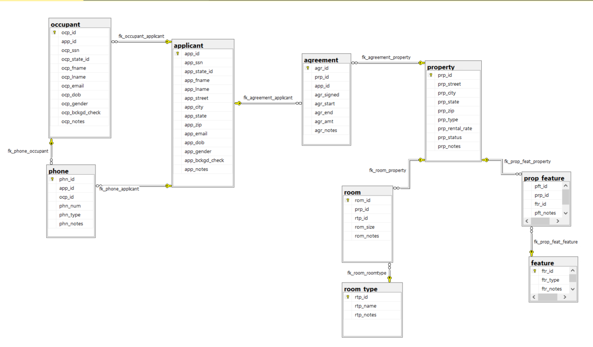

> **NOTE:** This README.md file should be placed at the **root of each of your main directory.**

# LIS3784 - Intermediate Database Management

## Jevon Price

In this unit, we created a database for a ~~slumlord~~ landlord. We track the tenants, the applicant, the agreement, and the property along with its features.

[a5_MSsqlserver](a5_MSsqlserver.sql) contains the code to build the database, insert data, and create views and stored procedures.

