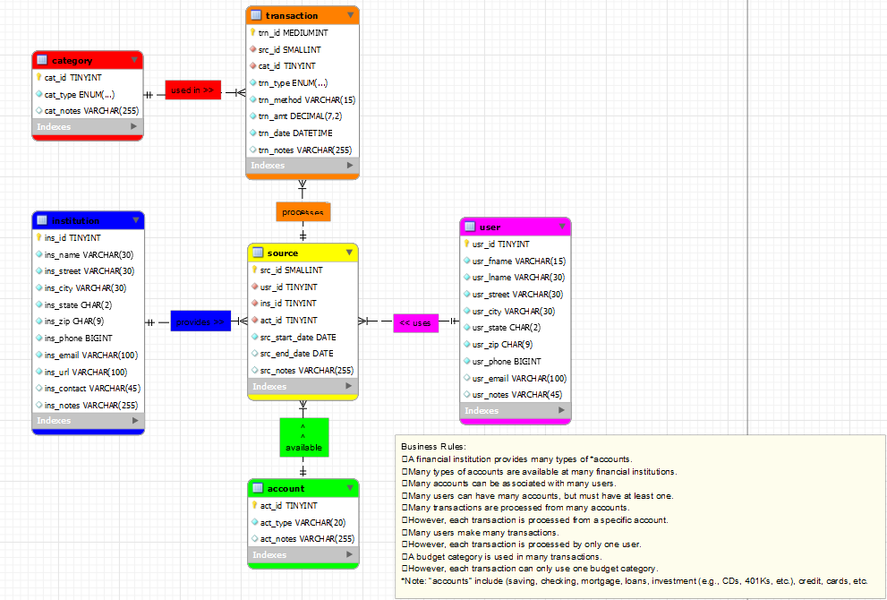

> **NOTE:** This README.md file should be placed at the **root of each of your main directory.**

# LIS3784 - Intermediate Database Management

## Jevon Price

In this unit, we designed and built a database to track bank account transactions.

**Business Rules:**
* A financial institution provides many types of *accounts.
* Many types of accounts are available at many financial institutions.
* Many accounts can be associated with many users.
* Many users can have many accounts, but must have at least one.
* Many transactions are processed from many accounts.
* However, each transaction is processed from a specific account.
* Many users make many transactions.
* However, each transaction is processed by only one user.
* A budget category is used in many transactions.
* However, each transaction can only use one budget category.

There is an [Excel file](P1_dd.xlsx) which contains the data dictionary and the [ERD file](p1model.mwb) along with a picture of the ERD inside this folder. There's also a script that was ran to pull data from a server to our database.

