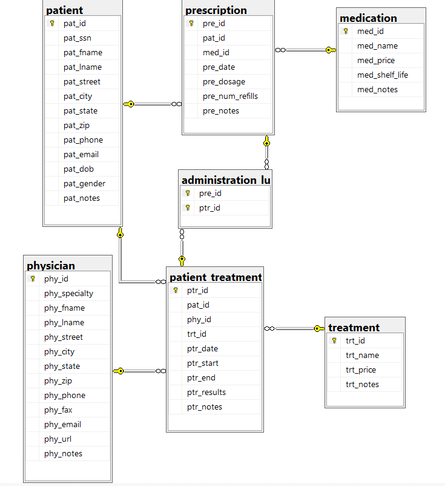

> **NOTE:** This README.md file should be placed at the **root of each of your main directory.**

# LIS3784 - Intermediate Database Management

## Jevon Price

In this unit, we created a database for a hospital to track its functions. It contains data on physicians, patients, and the treatments recieved by patients. [P2.sql](p2.sql) contains the code to build the database, insert data, and create views, stored procedures, transactions, and triggers.

