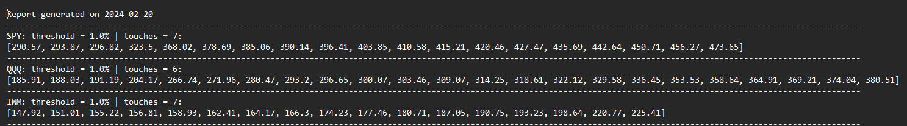

# Stock Level Creator

## This code genrates levels for a stock. 

### Here are the steps to properly run this code:
1. Firstly, you need to export your watchlist into a .txt format. *Try to put the .py file and watchlist.txt in the same folder.*

    * Name your file watchlist.txt to work with the code

    * I used TradingView so the format of the watchlist should be *'AMEX:SPY,NASDAQ:QQQ,AMEX:IWM'*.

2. Edit the global variables to your liking.

3. Edit all the touches_n lists to your liking or leave it as is. 
    * The lists should be look like: *touches_3 = ['AAPL', 'AMZN', 'BA']*

4. In preferred_threshold(), edit short_list or add more lists to adjust your thresholds for certain stocks. 

    * *I found that .03 works for most stocks and .01 for indexes*

5. In preferred_touches(), uncomment the lines where there are a corresponding touches_n- *if you have any*.

    * If you don't have a touches_3 list, move the if statement to the first list you have

6. Edit the ***start*** and ***end*** variables to your desired timeframe

7. If your watchlist is not named 'watchlist.txt' or in a different folder than the .py file, edit line 128.

8. If you want to change the name of the output file or put it in a different folder, edit lines 122 & 211.

9. Run the python file and your levels should be in the output file.

#### Here is a sample output:

